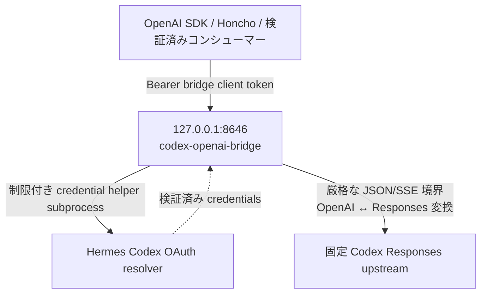
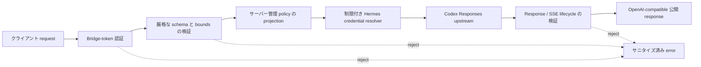
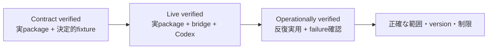

# codex-openai-bridge

[English (canonical)](README.md) | **日本語**

> **注記:** `README.md` が正本です。この翻訳と内容が異なる場合は、README.md が優先されます。

[](https://github.com/itmst71/codex-openai-bridge/actions/workflows/ci.yml)
[](LICENSE)
[](https://www.python.org/downloads/)

Codex Responses backend のための、処理範囲を制限した loopback 専用の OpenAI 互換 HTTP ブリッジです。OpenAI Python SDK、Honcho、LangChain、OpenAI Agents SDK などのコンシューマーは、安定した公開モデルエイリアス（`codex`）を使用できます。一方、upstream URL、OAuth 認証、account ID、実際の model はサーバー側で管理されます。

このプロジェクトは独立した変換サービスです。Hermes の agent loop、system prompt、memory、tools は実行**しません**。

## 想定用途とサービス利用条件

このrepositoryは、個人・単一ユーザー・ローカルでの実験用途を想定しています。処理範囲を
制限した互換adapterのsource codeを公開するものであり、ChatGPT/Codex subscriptionを
一般用途向けのsupport済みAPI serviceへ変換するものではありません。

- ブリッジ client token を共有しないでください。また、自分のaccountを他のユーザーが利用できる状態にしないでください。
- ChatGPT/Codex account をpoolしないでください。ユーザー別credentialやquotaを配布しないでください。
- subscription由来のaccessを再配布、計測販売、再販しないでください。
- team、hosted、public、commercial、CI inference serviceとして使用しないでください。
- 共有serviceやproduction automationには、そのbackend利用がtermsで許可されたcredentialとOpenAI公式APIを使用してください。

OpenAIは、subscription利用をAPI trafficへ変換して複数ユーザーへ再提供・共有することは
非supportであり、fraud-prevention systemのflag対象になり得ると説明しています。このprojectはOpenAIとは提携しておらず、承認・推奨・サポートも受けていません。このrepositoryにおける
技術検証は、特定deploymentの利用許可を示すものではありません。適用されるproduct termsの
確認は利用者の責任です。

MIT licenseはこのprojectのsource codeだけに適用されます。OpenAI serviceへアクセスまたは再配布する権利を付与しません。

Policy参照先: [Codex利用に関する説明](https://x.com/thsottiaux/status/2090675027670978569)、
[OpenAI Terms of Use](https://openai.com/policies/row-terms-of-use/)、
[OpenAI Account Sharing Policy](https://help.openai.com/en/articles/10471989-openai-account-sharing-policy)。

## アーキテクチャ



公開モデル名は常に `codex` です。ブリッジは、信頼されたサーバー側の状態から upstream model、URL、authorization、account、`store:false`、streaming policy、encrypted-reasoning include policy を再構成します。

## 対応範囲と非対応範囲

| インターフェース | 対応状況 |
| --- | --- |
| `GET /healthz` | 対応。プロセスの死活確認のみ |
| `GET /readyz` | 対応。処理時間を制限した credential readiness |
| `GET /v1/models` | 対応。`codex` のみを列挙 |
| `POST /v1/chat/completions` | 対応。SSE streaming を含む |
| `POST /v1/responses` | 実環境で検証済みの stateless subset に対応。名前付き Responses SSE events を含む |
| Function tools と tool history | 厳格な identity および call/output pairing checks 付きで対応 |
| 名前付き custom tool 1 個 | 正確な declaration、call、output replay、non-stream および stream lifecycles に対応。ブリッジが tool を実行することはない |
| Native context compaction | `context_management` を明示的に要求した場合、opaque で処理範囲を制限した checkpoint lifecycle として対応 |
| `text`、`json_object`、`json_schema` response formats | upstream の挙動を条件として対応 |
| Chat `max_tokens` と `max_completion_tokens` | SDK/Honcho との互換性のため受理し、厳格に検証する。ただし、Codex OAuth backend が `max_output_tokens` を拒否するため転送しない |
| Direct Responses `max_output_tokens` | 非対応。暗黙に無視せず拒否する |
| Reasoning、prompt cache、service tier、stream options、text verbosity | 後述する、実環境で検証済みの値に限り対応 |
| Usage projection と encrypted reasoning round-trip | 制限付きの検証を伴って対応。確認済みの `cache_write_tokens` は、SDK 3.1.0 では typed field、SDK 1.109.1 では `model_extra` に保持され、未知の usage fields は拒否される |
| `POST /v1/embeddings` | **Embeddings は非対応**。サニタイズ済みの unsupported error を返す |
| `previous_response_id`、conversations、stored response retrieval | 非対応。ブリッジは stateless を維持し、`store:false` を強制する |
| Local shell、web search、computer use、MCP、hosted tools、image input | 非対応として拒否する。機能のエミュレーションは行わない |
| クライアントが選択する upstream URL/model/account/auth policy | 非対応。無視または拒否する |
| 429、5xx、timeout、interrupted generation の自動 retry | 非対応。upstream 401 の後に限り、credential refresh/replay を正確に 1 回だけ行う |

このブリッジは、OpenAI Developer API と同等の SLA、embedding 対応、または ChatGPT/Codex subscription を service backend として恒久的に使用できる権利を保証しません。継続的にデプロイする前に、該当する製品条件と運用上の制限を確認してください。

### Direct Responses の機能契約

互換性は、OpenAI SDK の各リリースに存在するすべての field ではなく、実際の Codex backend の挙動に従います。未知の fields、未検証の enum values、stateful features、矛盾する SSE snapshots、不正または拡張された tool authority は、互換性のずれが暗黙に生じる前に拒否されます。



現在対応している direct Responses request controls は次のとおりです。

- 固定の公開 `model="codex"`、text `input`、およびサイズ制限付きの user/developer/assistant message items。
- `instructions`。
- `reasoning.effort`: `none`、`low`、`medium`、`high`、`xhigh`、または `max`。
- `reasoning.summary`: `auto`、`concise`、または `detailed`。
- サイズ制限付きの `prompt_cache_key`。
- `service_tier="default"`。
- streaming requests のみで `stream_options={"include_obfuscation": <bool>}`。
- `text.verbosity`: `low`、`medium`、または `high`。加えて、文書化されている JSON format subset。
- function tools、または exact named choice と `parallel_tool_calls=false` を指定した custom tool ちょうど 1 個。
- 正の値に制限した threshold を持つ `context_management=[{"type":"compaction","compact_threshold":N}]`。その組み合わせは backend に対して未検証であるため、compaction と function tools または custom tools は併用できません。
- `store=false` および `include=["reasoning.encrypted_content"]`。どちらの policy もサーバーが upstream で強制します。

逐次function-tool roundは、前roundのすべてのpending callに対応するoutputがある場合に対応します。
検証済みのreasoningまたはfunction callから次のroundを開始でき、reasoningから次のfunction roundを開始できますが、
すべてのparallel outputが完了した後に限ります。重複ID、繰り返しoutput、未完了のparallel round、
pending callが残る間のreasoning挿入は拒否します。

Developer messages は明示的な content-part form を使用します。Assistant replay items では、実環境で検証済みの `completed`、`in_progress`、`incomplete` status values と、任意の `commentary`/`final_answer` phase を受理します。Encrypted reasoning と compaction blobs は opaque replay authority として扱われます。ブリッジは内容をログに記録したり復号したりせず、bounds、ordering、identity、duplication を検証します。

検証済みの reasoning summaries は、クライアントが `reasoning.summary` を明示的に要求した場合に限って公開されます。要求されていない nonempty upstream summary は拒否されます。確認済みの assistant `phase` は、SDK 3.1.0 では typed field として、SDK 1.109.1 では `model_extra` を介して保持されます。

Custom-tool streaming は、backend の正確な item/input-delta lifecycle を SDK 形式の events に正規化し、provider obfuscation metadata を取り除きます。また、backend の completed snapshot で terminal custom call が欠落している場合は、それを復元します。検証済みの、両方が存在する identifier variant または両方が null の identifier variant のみを受理します。null identifiers は、衝突確認を行った決定的な public identifiers に置き換えられます。`stream_options.include_obfuscation=false` の場合、provider obfuscation field が省略されていても受理します。一方、存在するすべての obfuscation values には制限を適用し、検証します。

Offline contract tests は、固定した OpenAI Python SDK 1.109.1 と、別途 OpenAI Python SDK 3.1.0 に対して実行されます。Native compaction の typed SDK contract があるのは 3.1.0 のみです。共通の Responses request、function/custom tool、non-stream、stream subset は両方でテストされます。

## セキュリティ上の前提

- Bind addresses は loopback IPs でなければなりません。デフォルト値およびデプロイ時の値は `127.0.0.1` です。
- 保護対象の各 endpoint では、専用の 43 文字のブリッジ client token が必要です。この token は Codex OAuth token ではありません。
- ブリッジ client token は、owner-only、mode `0600`、non-symlink regular file から読み込まれます。
- Codex OAuth credentials は、Hermes Python environment を使用する処理時間制限付き subprocess によって解決されます。この repository や systemd unit にはコピーされません。
- Upstream URL、authorization、account ID、model、prompts、tool arguments、encrypted reasoning は、operational logs と sanitized errors から除外されます。
- Request bodies、JSON structure、helper output、upstream bodies、SSE events/streams、queueing、concurrency、deadlines、shutdown には制限が適用されます。
- Hermes はそこで認証状態を atomic に更新する場合があるため、`ProtectHome=read-only` は `ReadWritePaths=%h/.hermes` を指定した場合に限って緩和されます。systemd units では、`%h` は service user の home directory に展開されます。
- sandbox は、意図しないアクセスと service compromise の影響を軽減します。同じ Unix UID ですでに実行されているあらゆる malicious process から保護できるとはしていません。
- port 8646 を public reverse proxy 経由で公開しないでください。信頼できる remote コンシューマーが必要な場合は、別途レビューした authenticated tunnel を使用し、loopback bind を維持してください。

## 設定

environment を作成し、固定された project をインストールします。

```bash
git clone https://github.com/itmst71/codex-openai-bridge.git \
  "$HOME/src/codex-openai-bridge"
cd "$HOME/src/codex-openai-bridge"
uv sync --locked
```

service は、検証済みの environment variables を読み込みます。主な settings と defaults は次のとおりです。

| 変数 | デフォルト | 注記 |
| --- | --- | --- |
| `CODEX_BRIDGE_HOST` | `127.0.0.1` | IPv4 または IPv6 の loopback address でなければならない |
| `CODEX_BRIDGE_PORT` | `8646` | TCP port 1–65535 |
| `CODEX_BRIDGE_CLIENT_TOKEN_FILE` | `~/.config/codex-openai-bridge/client-token` | Absolute path。owner、regular file、mode `0600` |
| `CODEX_BRIDGE_UPSTREAM_MODEL` | project default | サーバーが管理する canonical model identifier |
| `CODEX_BRIDGE_HERMES_PYTHON` | `$HOME/.hermes/hermes-agent/venv/bin/python` | Hermes credential-helper interpreter。現在の user の home から解決される |
| `CODEX_BRIDGE_HELPER_PATH` | installed package helper | Absolute helper path |
| `CODEX_BRIDGE_MAX_IN_FLIGHT` | `2` | 同時実行 owners の上限。最大 10 |
| `CODEX_BRIDGE_QUEUE_WAIT_SECONDS` | `10` | admission wait の上限 |
| `CODEX_BRIDGE_TOTAL_REQUEST_DEADLINE_SECONDS` | `240` | downstream writes を含む request 全体 |

追加の `CODEX_BRIDGE_MAX_*` と timeout variables は、`config.py` で厳格に制限されています。無効、noncanonical、non-loopback、または不整合な settings がある場合、起動に失敗します。

repository に含まれる user unit には、意図的に `EnvironmentFile=` も secret も含めていません。secret 以外の overrides には、user-unit drop-in を使用してください。

```ini
[Service]
Environment=CODEX_BRIDGE_PORT=8646
```

`systemctl --user edit codex-openai-bridge.service` で作成し、その後 `systemctl --user daemon-reload` を実行して service を再起動します。

## ブリッジ client token の生成

32 random bytes ちょうどを、padding なしの URL-safe 43 characters として encode します。値を表示したり commit したりしないでください。

```bash
install -d -m 700 "$HOME/.config/codex-openai-bridge"
umask 077
"$HOME/src/codex-openai-bridge/.venv/bin/python" -c \
  'import secrets,sys; sys.stdout.write(secrets.token_urlsafe(32) + "\n")' \
  > "$HOME/.config/codex-openai-bridge/client-token"
chmod 600 "$HOME/.config/codex-openai-bridge/client-token"
```

コンシューマーの設定ではこの file を参照し続けるか、そのコンシューマーの secret mechanism を介して値を注入してください。値を repository、unit、journal、command history に置かないでください。

## systemd user service のデプロイ

host には user manager が必要です。logout/boot 後も動作を継続するには、さらに linger が必要です（`loginctl show-user "$USER" -p Linger`）。linger の有効化には administrator が必要な場合があります。

使用中の port で起動しないよう、検証してからインストールします。

```bash
cd "$HOME/src/codex-openai-bridge"
uv sync --locked
systemd-analyze --user verify deploy/systemd/codex-openai-bridge.service
install -Dm644 deploy/systemd/codex-openai-bridge.service \
  "$HOME/.config/systemd/user/codex-openai-bridge.service"
systemctl --user daemon-reload
systemctl --user enable codex-openai-bridge.service
```

repository に含まれる unit は systemd の `%h` specifier を使用しているため、この checkout が `$HOME/src/codex-openai-bridge` にあることを前提としています。別の場所にインストールする場合は、unit をコピーし、検証前に `WorkingDirectory` と `ExecStart` をその checkout の absolute paths に置き換えてください。

起動前に、手動で起動したブリッジがあれば停止し、port 8646 が空いていることを確認します。

```bash
ss -ltnp '( sport = :8646 )'
systemctl --user start codex-openai-bridge.service
```

実際の unit、process、listener、health、journal を確認します。

```bash
systemctl --user is-enabled codex-openai-bridge.service
systemctl --user is-active codex-openai-bridge.service
systemctl --user show codex-openai-bridge.service \
  -p MainPID -p NRestarts -p ActiveState -p SubState
ss -ltnp '( sport = :8646 )'
curl --fail --silent --show-error http://127.0.0.1:8646/healthz
curl --fail --silent --show-error http://127.0.0.1:8646/readyz
journalctl --user -u codex-openai-bridge.service --no-pager -n 30
```

設定した port を listen する正規のブリッジ process は 1 つだけにしてください。

## Honcho の分離設定

Honcho の **text generation** modules はブリッジに向け、embeddings には別の provider を使用してください。Codex を使用する summary、dream、derivation、dialectic model configurations にも、同じ override を適用します。

```toml
[deriver.model_config]
transport = "openai"
model = "codex"

[deriver.model_config.overrides]
base_url = "http://127.0.0.1:8646/v1"
api_key_env = "CODEX_BRIDGE_CLIENT_TOKEN"
```

Codexブリッジでは、Honcho既定のnative `json_schema` structured-output modeを維持してください。
`structured_output_mode = "json_object"`は設定しないでください。制限付きのlive probeでは
`json_object`が一貫してupstream 502を返した一方、同じderivationはnative `json_schema`で
正常に完了しました。

独自の base URL と `api_key_env` を持つ、別の OpenAI-compatible embedding backend を使用してください。embeddings がなくてもよいブリッジのみの初期実験では、次を明示的に設定します。

```bash
EMBED_MESSAGES=false
```

Honcho embedding requests をこのブリッジに向けないでください。

現在の Honcho は、text calls で token-limit field を送信します。ブリッジはその field を検証しますが、ChatGPT Codex Responses backend が `max_output_tokens` を拒否するため、generation 時に上限を適用できません。それでもブリッジは、設定済みの total deadline、upstream/downstream byte caps、SSE-event cap、JSON bounds を適用します。このブリッジを text backend として使用する場合、Honcho の `max_tokens` 値を厳密な generation limit として扱わないでください。

## コンシューマー互換性の状況

Provider の機能とコンシューマー互換性は別々の契約です。ブリッジは Codex-backed API subset を狭く保ちながら、各コンシューマーが実際に送信する HTTP shape を loopback route、strict parser、upstream projection、コンシューマー固有の response parser を通してテストします。

対応状況の意味は次のとおりです。

- **Contract verified（contract検証済み）** — 固定した実packageのserializer/parserが、決定的な
  upstream fixtureに対して記載のcontractを完了しています。正確なwire shapeの証明であり、live provider利用の証明ではありません。
- **Live verified（live検証済み）** — 固定した実packageが、稼働中bridgeと実Codex backendを通して代表操作を完了しています。
- **Operationally verified（実運用検証済み）** — 実用applicationを実dataまたは実sourceで繰り返し使用し、
  記載のmulti-turn/toolおよびfailure-recovery境界まで確認しています。
- **Unsupported / external provider required（非対応／外部provider必須）** — Codex backendが能力を
  提供できないか、embedding providerなど別authorityへ意図的に分離しています。

`設定が必要`、`adapterが必要`、`範囲限定`、`役割限定`、`componentのみ`などの注記は証拠範囲を
さらに限定します。fixtureまたはserializer互換性だけでは実運用supportを意味しません。また、
どの行も記載されていないproduct surfaceのsupportを意味しません。



| コンシューマー / tool | 対応状況 | 動作確認済み version | 検証済みの範囲 | 未検証事項 / 必要条件 |
| --- | --- | --- | --- | --- |
| OpenAI Python SDK | **Live verified（live検証済み）** | 1.109.1 and 3.1.0 | live Chat/Responses non-stream/streamと、offline structured output、function/custom-tool、usage、compaction contract | `max_retries=0`を使用。非対応OpenAI API surfaceや長時間application挙動の検証ではない |
| Honcho | **Operationally verified（実運用検証済み）** | revision `444897975c95393b0d48024470ece03c025d3aa4`を基にしたself-hosted request shape | 反復derivation、summary/dream/dialectic生成、structured output、memory-search tool continuation、再起動、queue、既存PostgreSQL/Redis continuity | Embeddingsは別backendが必要。losslessなnullable tool-call contentは現在[plastic-labs/honcho#1061](https://github.com/plastic-labs/honcho/issues/1061)のcompatibility fixが必要 |
| LangChain `ChatOpenAI` | **Operationally verified（範囲限定）** | `langchain-openai` 1.6.0、`langchain-core` 1.6.0、`langgraph` 1.2.11、`langchain` 1.3.17、`langchain-ollama` 1.1.0、`langgraph-checkpoint-sqlite` 3.1.1、OpenAI SDK 3.3.1 | live non-stream、同期stream、公式aiohttp transportによるasync Responses streaming、strict Pydantic、Responses 1-toolおよび逐次multi-tool、Chat逐次multi-tool、3-turn history、bounded `batch()`/`abatch()` concurrency（4入力・最大2）、注入した429 1回とstream途中切断1回からの回復、bounded LangGraph read-only graph、外部Ollama `embeddinggemma`によるplain-text in-memory RAG、Chat Completions modeのstandard `create_agent`、consumer-side SQLite interrupt/resume | `temperature=None`、`max_retries=0`、`use_responses_api`選択、`openai[aiohttp]`、`trust_env=False`の明示的sync/async client、`http_socket_options=()`、typed completed terminal確認が必要。persistent vector store、production corpusのretrieval評価、PostgreSQL checkpoint、checkpoint concurrent writer、multiple interrupt、standard-agent Responses mode、daemon長期利用、2を超える並列、反復exhaustion／interruptionは未検証 |
| OpenAI Agents SDK | **Live verified（設定が必要）** | `openai-agents` 0.21.1, OpenAI SDK 3.2.0 | live `OpenAIChatCompletionsModel` basic agentとlocal `function_tool` loop。offline stream contract | tracingを無効化。`OpenAIResponsesModel`、sessions、hosted toolsは未検証 |
| AutoGen | **Contract verified（adapterが必要）** | `autogen-ext`/`autogen-core`/`autogen-agentchat` 0.7.5, OpenAI SDK 3.2.0 | Direct non-stream/stream、Pydantic JSON Schema、`AssistantAgent` local function-tool/reflection contract | explicit model metadataとconditional parallel-tools adapterが必要。live継続利用、teams、code execution、memory、hosted agentsは未検証 |
| Aider | **Contract verified（役割限定）** | `aider-chat` 0.86.2, LiteLLM 1.81.10, OpenAI SDK 2.20.0 | One-shot CLI `--message` contractで既存file 1個をstreaming `whole`-format編集 | live継続利用、interactive mode、auto-commit、repo map、architect/weak-model flows、その他edit formatsは未検証 |
| Cline CLI | **Live verified（役割限定）** | Linux x64 binary 3.0.55 | 実Codexでone-shot headless `read_files` → `editor` → `submit_and_exit`編集 | local-only flagsと短いsystem promptが必要。継続利用、他platform、default control plane、shell/web/MCP/subagents/teams、IDE/TUI、non-idempotent toolsは未検証 |
| Continue core OpenAI provider | **Contract verified（componentのみ）** | `@continuedev/core` 1.1.0, `tsx` 4.23.12 | 公開`streamChat`、Edit-role `streamComplete`、non-stream function-tool result contract | Chat/Edit componentのみ。live継続利用、Apply/file mutation、現行`cn` CLI、autocomplete、embeddings、IDE UIは未検証 |

LangChainのbatch/concurrency evidenceはone-shotであり、反復batch/concurrency runは未検証です。
反復exhaustion／interruptionは未検証であり、daemon-mode利用は未検証です。
standard-agent Responses modeは未検証です。

LangGraph、RAG、standard agent、HITLの表記はconsumer-sideかつscope-exactです。
RAGは外部Ollama `embeddinggemma` backendを768 dimensionsで使用し、bridgeへEmbeddings capabilityを追加しません。
HITLはconsumer-side SQLite checkpointerを使用し、bridgeはstatelessのままで、HITL pause/resume requestを受けません。
検証済みRAG storeはdisposable/in-memoryです。standard agentにはmiddleware、store、checkpointerがありません。
standard agentはChat Completions限定でread-only repository toolsだけを使用します。

これらの framework packages は、分離された CI contract dependencies であり、ブリッジの runtime dependencies ではありません。テストでは synthetic credentials と deterministic upstream fixtures を使用するため、通常の project tests と production deployment が frameworks の external services をインストールしたり、接続したりすることはありません。

### LangChain

```python
import asyncio

from langchain_openai import ChatOpenAI
from openai import DefaultAioHttpClient, DefaultHttpxClient


async def main() -> None:
    sync_http_client = DefaultHttpxClient(trust_env=False)
    async_http_client = DefaultAioHttpClient(trust_env=False)
    llm = ChatOpenAI(
        model="codex",
        base_url="http://127.0.0.1:8646/v1",
        api_key=bridge_token,
        temperature=None,
        max_retries=0,
        timeout=240,
        use_responses_api=True,
        http_client=sync_http_client,
        http_async_client=async_http_client,
        http_socket_options=(),
    )
    try:
        response = await llm.ainvoke("Reply briefly.")
        print(response.content)
    finally:
        await llm.root_async_client.close()
        llm.root_client.close()


asyncio.run(main())
```

検証済みの Chat Completions path を選択する場合は、`use_responses_api=False` を設定します。`bind_tools` を介して渡す Pydantic models と functions には、nonempty docstring/description が必要です。description が欠けていると `description=""` になる場合があります。ブリッジは正確な tool contract を弱めるのではなく、これを意図的に拒否します。embeddings は別に設定してください。
async Responses streamingでは`openai[aiohttp]`を導入し、modelが所有するclientを明示的にcloseしてください。
LangChainが`object=response`、`status=completed`、`chunk_position=last`を持つ最終chunkを公開した後だけ
outputを成功として受理します。切断前のpartial textは成功ではありません。
検証済みloopback設定では、proxy継承とLangChain transport注入を防ぐため、両clientへ`trust_env=False`を設定し、
`http_socket_options=()`を指定します。

### OpenAI Agents SDK

```python
from agents import Agent, OpenAIChatCompletionsModel, set_tracing_disabled
from openai import AsyncOpenAI

set_tracing_disabled(True)
client = AsyncOpenAI(
    base_url="http://127.0.0.1:8646/v1",
    api_key=bridge_token,
    max_retries=0,
    timeout=240,
)
model = OpenAIChatCompletionsModel(model="codex", openai_client=client)
agent = Agent(name="bounded-agent", instructions="Answer briefly.", model=model)
```

検証済みのブリッジ専用 configuration では tracing を無効にします。tracing は別の external API surface だからです。nonempty docstrings を持つ local `function_tool` calls は検証済みです。Agents SDK の `OpenAIResponsesModel` は現在、厳格なブリッジ Responses subset の範囲外の fields を送信します。SDK 全体を非対応とみなしたりブリッジ parser を緩和したりせず、検証済みの Chat Completions model を使用してください。

### AutoGen

AutoGen の OpenAI-compatible model client では、未知の public alias に対する capabilities を明示し、sampling/name fields を省略する必要があります。

```python
from autogen_core.models import ModelFamily
from autogen_ext.models.openai import OpenAIChatCompletionClient

client = OpenAIChatCompletionClient(
    model="codex",
    base_url="http://127.0.0.1:8646/v1",
    api_key=bridge_token,
    model_info={
        "vision": False,
        "function_calling": True,
        "json_output": True,
        "family": ModelFamily.UNKNOWN,
        "structured_output": True,
    },
    max_retries=0,
    timeout=240,
    include_name_in_message=False,
)
```

`AssistantAgent` reflection loop では、constructor に `parallel_tool_calls=False` を設定するだけでは不十分です。AutoGen は、後続の reflection request で `tools` を削除した後にもこれを送信し、厳格なブリッジは正しく拒否します。`tests/consumer_contract/test_autogen.py` にある検証済みの `BridgeOpenAIChatCompletionClient` adapter は、request に実際に tools が含まれる場合に限ってその field を追加します。gateway contract を弱めることなく、AutoGen の通常の direct client、local tool execution、tool-result replay、reflected final answer を維持します。

恒常的な matrix では、direct non-stream text、final `CreateResult` を伴う token streaming、Pydantic JSON Schema output、新規の `AssistantAgent` による local function-tool/reflection run 1 回を検証します。teams、handoffs、code execution、web/file surfers、MCP/workbenches、model cache、memory、image input、hosted assistants、multi-agent state の対応を示すものではありません。embeddings は別に設定し、model client は必ず close してください。

### Aider

Aider は OpenAI-compatible Chat Completions endpoint を使用します。未知の public alias は、target repository の外に置く non-secret model settings file に登録してください。たとえば `$HOME/.config/codex-openai-bridge/aider-model-settings.yml` を使用すると、Aider が非対応の sampling control を送信しなくなります。

```yaml
- name: openai/codex
  edit_format: whole
  weak_model_name: null
  use_repo_map: false
  use_temperature: false
  streaming: true
  cache_control: false
  caches_by_default: false
```

Aider は、local definition が与えられない限り、unknown-model metadata の更新も試みます。2 つ目の non-secret file は target repository の外に保存します。たとえば `$HOME/.config/codex-openai-bridge/aider-model-metadata.json` とします。

```json
{
  "openai/codex": {
    "max_tokens": 200000,
    "max_input_tokens": 200000,
    "max_output_tokens": 100000,
    "input_cost_per_token": 0,
    "output_cost_per_token": 0,
    "litellm_provider": "openai",
    "mode": "chat"
  }
}
```

再現可能な形で検証済みの role は one-shot edit であり、Aider の default interactive mode ではありません。次の例では Aider state を target repository の外に置き、contract が対象とする side effects を無効にし、LiteLLM に bundled model-cost map の使用を強制します。

```bash
control_dir="$(mktemp -d)"
trap 'rm -rf -- "$control_dir"' EXIT
printf '{}\n' > "$control_dir/aider.conf.yml"
: > "$control_dir/empty.env"
IFS= read -r OPENAI_API_KEY \
  < "$HOME/.config/codex-openai-bridge/client-token"
export OPENAI_API_KEY LITELLM_LOCAL_MODEL_COST_MAP=True

aider \
  --model openai/codex \
  --openai-api-base http://127.0.0.1:8646/v1 \
  --model-settings-file "$HOME/.config/codex-openai-bridge/aider-model-settings.yml" \
  --model-metadata-file "$HOME/.config/codex-openai-bridge/aider-model-metadata.json" \
  --config "$control_dir/aider.conf.yml" \
  --env-file "$control_dir/empty.env" \
  --input-history-file "$control_dir/input.history" \
  --chat-history-file "$control_dir/chat.history.md" \
  --edit-format whole \
  --message "Set VALUE to 2." \
  --file target.py \
  --stream \
  --yes-always \
  --no-auto-commits \
  --no-dirty-commits \
  --no-gitignore \
  --no-attribute-author \
  --no-attribute-committer \
  --no-attribute-co-authored-by \
  --no-auto-lint \
  --no-auto-test \
  --no-watch-files \
  --no-cache-prompts \
  --map-tokens 0 \
  --no-analytics \
  --no-check-update \
  --no-show-release-notes \
  --no-show-model-warnings \
  --no-check-model-accepts-settings \
  --no-pretty \
  --no-fancy-input \
  --no-notifications \
  --no-detect-urls \
  --no-suggest-shell-commands \
  --no-gui \
  --no-copy-paste \
  --disable-playwright \
  --timeout 240 \
  --encoding utf-8 \
  --line-endings lf

unset OPENAI_API_KEY LITELLM_LOCAL_MODEL_COST_MAP
```

恒常的な contract では、実際の Aider CLI を `--message` mode で駆動し、production-like loopback ブリッジから streaming whole-file listing 1 件を受信し、tracked file を正確に 1 個だけ編集します。repository artifact は作成せず、Git HEAD は変更しません。Aider 0.86.2 には独自の制限付き transient-API retry loop があり、他のコンシューマー向けの OpenAI SDK `max_retries=0` guidance とは別物です。検証済みの Aider role は text editing のみを行い、model tool calls や auto-commit side effect はありません。Architect mode、weak/editor model flows、repo map、auto-commit、lint/test repair loops、`diff`/`udiff` formats、image input、interactive multi-turn behavior は、それぞれテストされるまで対応を保証しません。

### Cline CLI

検証済みの Cline role は、意図的に Cline の default product surface より狭く設定されています。実際の 3.0.55 headless CLI を使用し、`read_files`、`editor`、`submit_and_exit` だけを有効にして、local で exact-replacement edit を 1 回実行します。Cline state と hooks は target repository の外に置きます。

private temporary state root を用意し、hosted feature flags、logging、updates、compaction、shell commands、web tools、skills、subagents、teams を無効にします。

```bash
control_dir="$(mktemp -d)"
workspace="$(pwd -P)"
trap 'rm -rf -- "$control_dir"' EXIT
install -d -m 700 "$control_dir/data/settings" "$control_dir/hooks"
cat > "$control_dir/data/settings/global-settings.json" <<'JSON'
{
  "autoUpdateEnabled": false,
  "compactionEnabled": false,
  "disabledTools": [
    "ask_question", "fetch_web_content", "run_commands", "search_codebase",
    "skills", "spawn_agent", "teams", "web_search"
  ],
  "telemetryOptOut": true,
  "toolAutoApprove": true
}
JSON

IFS= read -r bridge_token \
  < "$HOME/.config/codex-openai-bridge/client-token"
E2E_TEST=true CLINE_DATA_DIR="$control_dir/data" CLINE_LOG_ENABLED=0 \
  cline auth --provider openai --apikey "$bridge_token" --modelid codex \
  --baseurl http://127.0.0.1:8646/v1 --data-dir "$control_dir/data"
unset bridge_token

export E2E_TEST=true CLINE_DATA_DIR="$control_dir/data" CLINE_LOG_ENABLED=0
export CLINE_SESSION_BACKEND_MODE=local CLINE_SANDBOX=1
export CLINE_COMMAND_PERMISSIONS='{"allow":[],"deny":["*"],"allowRedirects":false}'

cline --yolo --json --thinking none --compaction off --retries 0 --timeout 240 \
  --provider openai-compatible --model codex \
  --cwd "$workspace" --data-dir "$control_dir/data" --hooks-dir "$control_dir/hooks" \
  --system "You are a bounded coding agent. The workspace root is $workspace. Use absolute paths under that root. Use read_files, editor, and submit_and_exit only. Never run shell commands." \
  "Read $workspace/target.txt. Use editor for the requested exact replacement, then submit and exit."
```

これらの controls は、任意の compatibility polish ではありません。

- 通常の Cline startup は、telemetry opt-out 後も feature flags のため `data.cline.bot` に接続します。version 3.0.55 固有の `E2E_TEST=true` branch は NoOp feature-flag provider を選択します。
- Cline の default 3,421-character system prompt はブリッジに到達しますが、制限付きの probes では一貫して Codex upstream 502 が発生しました。短い override では、正確な absolute workspace root も復元する必要があります。
- `--yolo` は Cline で文書化されていますが、この version の `--help` では非表示です。これにより subagents と teams が無効になり、検証済みの 3 つの local tools が残ります。
- `--retries 0` は Cline の agent mistake loop を制限するもので、HTTP transport retries を制限するものではありません。transient failure によって同じ model request が繰り返される可能性があるため、non-idempotent external tool roles は未検証です。

恒常的な contract は、コンシューマー専用 lock から Cline の integrity-pinned Linux x64 binary package だけを、lifecycle scripts を無効にしてインストールします。Cline の別個の Node SDK dependency graph はインストールしません。binary は native loopback-only connect guard の背後で動作し、production-like ブリッジを介して厳格な streaming function calls を 3 回受信し、`VALUE=1` だけを `VALUE=2` に変更します。Git HEAD は変更されず、repository artifact も作成されません。default prompt、feature-flag service、interactive TUI、VS Code/JetBrains/ACP、shell/web/browser tools、MCP、plugins、skills、hooks、subagents、teams、hub、schedules、connectors、Kanban、resumed sessions、images、compaction は対応を保証しません。

この matrix の versions は、再現可能な動作確認済みの baseline であり、runtime allowlist ではありません。ブリッジは package versions を受信しません。より新しいコンシューマーでも、送信する HTTP payload が同じ厳格な contract を満たす限り使用できます。

### Continue core OpenAI provider

Continue は model roles を分離するため、ブリッジは text generation を担当し、embeddings と autocomplete には他の providers を使用してください。対応する local model entry は次のとおりです。

```yaml
models:
  - name: Codex Bridge
    provider: openai
    model: codex
    apiBase: http://127.0.0.1:8646/v1
    apiKey: ${{ secrets.OPENAI_API_KEY }}
    useLegacyCompletionsEndpoint: false
    roles:
      - chat
      - edit
    defaultCompletionOptions:
      maxTokens: 4096
```

この model に `temperature`、`topP`、penalties、stop words、`autocomplete`、`embed` を追加しないでください。検証済みの package contract は、Continue core の公開 `streamChat` と `streamComplete` methods を呼び出し、streaming Chat と Edit-role generation を実行し、function-tool call/result/final-answer round-trip を完了します。4 つの requests はすべて `/v1/chat/completions` を使用し、ブリッジの server-owned policy を維持し、non-loopback connection を行いません。

これは、Continue IDE 全体または現在の `cn` CLI への対応を示すものではありません。read-only headless の `@continuedev/cli` 1.5.47 probe はブリッジ経由の generation に成功しましたが、startup 時に `api.continue.dev` への接続も試みました。このため、対応済みの local-only control-plane configuration が利用可能になるまでは未検証です。Autocomplete/FIM、embeddings、reranking、file application、agent tools、image input、Responses API selection も同様に対応を保証しません。

公開されている `@continuedev/core` 1.1.0 compiled ESM subpath は、内部 import の 1 つに file extension がないため、レビュー対象の Node 20/24 runtimes では単独で import できません。そのため contract は、固定した `tsx` を介して、その正確な package に同梱された TypeScript source を実行します。これは Continue 自身の build が使用する source でもあります。完全な optional npm graph は、consumer-contract `package-lock.json` によって固定されます。lifecycle scripts は無効であり、使用しない native SQLite logger dependency は、その logging method を probe で無効にする前に、固定したコンシューマー専用 stub へ置き換えられます。これらの packages がブリッジ runtime または development dependencies になることはありません。Continue で成功した残りの requests の local logs は、CI 内の isolated HOME に限定されます。telemetry は無効で、self-tested socket guard が external network access を拒否します。

## curl の例

この local example は、ブリッジ token を表示せずに読み込みます。同じ UID の process は process arguments を調べられる場合がありますが、これは記載した same-UID threat model の範囲外です。

```bash
IFS= read -r bridge_token < "$HOME/.config/codex-openai-bridge/client-token"
curl --fail --silent --show-error \
  -H "Authorization: Bearer ${bridge_token}" \
  http://127.0.0.1:8646/v1/models
unset bridge_token
```

最小限の Chat Completions request では `model: codex` を使用します。server はこれを、設定された upstream model に置き換えます。

## OpenAI SDK の例

```python
from pathlib import Path
from openai import OpenAI

client = OpenAI(
    base_url="http://127.0.0.1:8646/v1",
    api_key=Path.home()
    .joinpath(".config/codex-openai-bridge/client-token")
    .read_text(encoding="ascii")
    .strip(),
    max_retries=0,
    timeout=240.0,
)

models = client.models.list()
assert any(model.id == "codex" for model in models.data)

completion = client.chat.completions.create(
    model="codex",
    messages=[{"role": "user", "content": "Reply briefly."}],
)
print(completion.choices[0].message.content)
```

`max_retries=0` を維持してください。曖昧な automatic generation retries により、output や tool calls が重複する可能性があります。

## アップグレードとロールバック

1. credentials を記録せず、現在デプロイされている Git revision を記録します。
2. user service を停止し、listener がなくなったことを確認します。
3. checkout をレビュー済みの revision に更新します。
4. `uv sync --locked`、すべての test/type/lint gates、`systemd-analyze --user verify` を実行します。
5. unit を再インストールし、`systemctl --user daemon-reload` を実行してから、起動して health/readiness/listener ownership を確認します。

```bash
cd "$HOME/src/codex-openai-bridge"
systemctl --user stop codex-openai-bridge.service
git switch --detach <reviewed-revision>
uv sync --locked
systemd-analyze --user verify deploy/systemd/codex-openai-bridge.service
install -Dm644 deploy/systemd/codex-openai-bridge.service \
  "$HOME/.config/systemd/user/codex-openai-bridge.service"
systemctl --user daemon-reload
systemctl --user start codex-openai-bridge.service
```

rollback では、以前に記録した reviewed revision と、それに対応する lockfile/unit を使用して、同じ制限付き手順を繰り返します。異なる revisions の source、lockfile、virtual environment、unit definitions を混在させないでください。external token と Hermes authentication state は Git rollback の対象ではありません。

## 明示的に有効化する live tests

通常の tests は fake loopback upstreams を使用し、実際の credentials は使用しません。明示的に有効化しない限り、live tests は動作しません。

別途起動し、検証済みのブリッジを使用する場合は次のとおりです。

```bash
export RUN_LIVE_CODEX=1
export CODEX_BRIDGE_LIVE_BASE_URL=http://127.0.0.1:8646/v1
IFS= read -r CODEX_BRIDGE_LIVE_API_KEY \
  < "$HOME/.config/codex-openai-bridge/client-token"
export CODEX_BRIDGE_LIVE_API_KEY
uv run pytest tests/live/test_live_codex.py -q
unset RUN_LIVE_CODEX CODEX_BRIDGE_LIVE_BASE_URL CODEX_BRIDGE_LIVE_API_KEY
```

より広範な SDK smoke script も、明示的に有効化した場合のみ実行されます。明示的な base URL と token environment variable がなければ接続を拒否します。

```bash
export CODEX_BRIDGE_BASE_URL=http://127.0.0.1:8646/v1
IFS= read -r CODEX_BRIDGE_CLIENT_TOKEN \
  < "$HOME/.config/codex-openai-bridge/client-token"
export CODEX_BRIDGE_CLIENT_TOKEN
uv run python scripts/smoke_openai_sdk.py
unset CODEX_BRIDGE_BASE_URL CODEX_BRIDGE_CLIENT_TOKEN
```

credential values を bug reports、test logs、shell transcripts、review prompts に含めないでください。

## セキュリティ

デプロイ前に、前述の loopback-only threat model を確認してください。脆弱性は [SECURITY.md](SECURITY.md) に記載された手順で報告し、credentials や sensitive request data を public issue に記載しないでください。

## ライセンス

[MIT License](LICENSE) に基づいてライセンスされています。
