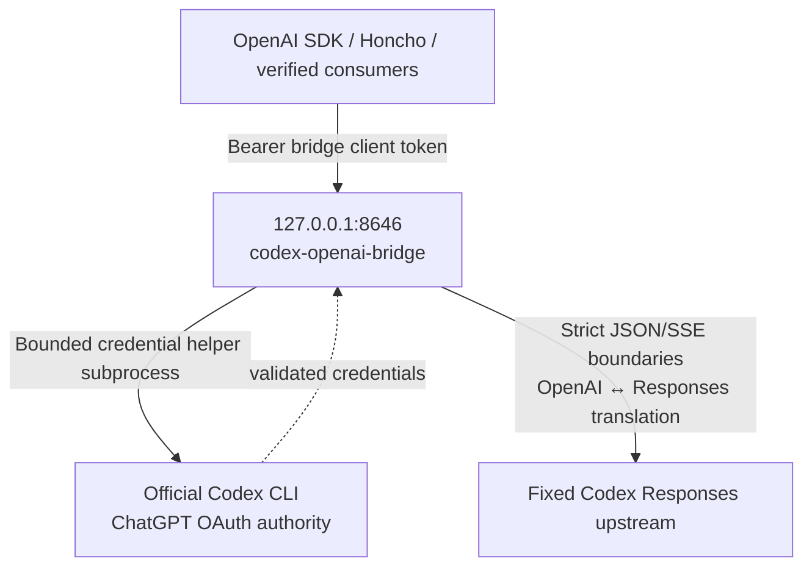
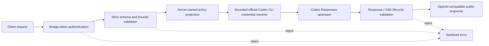
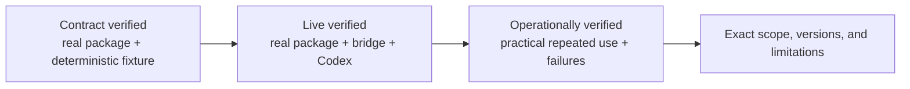

# codex-openai-bridge

**English (canonical)** | [日本語](README.ja.md)

> `README.md` is the canonical documentation. If the Japanese translation differs, the English
> version takes precedence.

[](https://github.com/itmst71/codex-openai-bridge/actions/workflows/ci.yml)
[](LICENSE)
[](https://www.python.org/downloads/)

A bounded, loopback-only OpenAI-compatible HTTP bridge for the Codex Responses backend. It lets consumers such as the OpenAI Python SDK, Honcho, LangChain, and the OpenAI Agents SDK select from server-approved aliases while keeping the upstream URL, OAuth authorization, account ID, and real model under server control. The required default alias is `codex`.

This project is an independent translation service. It does **not** run an agent loop, system
prompt, memory, or tools.

## Prerequisites

Install the official OpenAI Codex CLI on the bridge host.
Codex CLI 0.146.0 is the verified version for this release.
Other Codex CLI versions remain unverified.

```bash
codex --version
```

Before login, configure the initial supported credential store, file mode, in
`$HOME/.codex/config.toml`:

```toml
cli_auth_credentials_store = "file"
```

Then sign in with ChatGPT:

```bash
codex login                 # or: codex login --device-auth
codex login status
```

Normalize the credential directory and file authority after login:

```bash
chmod 700 "$HOME/.codex"
chmod 600 "$HOME/.codex/auth.json"
```

The resulting `$HOME/.codex/auth.json` is password-equivalent. Keep it owner-only at mode `0600`
and never copy it into issues, logs, chat, or this repository.
Keyring and `auto` storage are not supported by this release. Hermes is not required;
no third-party agent framework is required.

API-key authentication is intentionally unsupported. If you have an OpenAI API key,
use the official OpenAI API directly without this bridge; this project will not add an API-key
fallback or provider switch.

## Intended use and service terms

This repository is intended for personal, single-user, local experimentation. It publishes
source code for a bounded compatibility adapter; it does not turn ChatGPT/Codex subscription
usage into a supported general-purpose API service.

- Do not share the bridge client token or make your account available to another user.
- Do not pool ChatGPT/Codex accounts or distribute per-user credentials or quotas.
- Do not redistribute, meter, or resell subscription-backed access.
- Do not use this bridge as a team, hosted, public, commercial, or CI inference service.
- For shared services or production automation, use the official OpenAI API and credentials whose
  terms permit that backend use.

OpenAI has stated that converting subscription usage into API traffic for re-serving or sharing
across users is unsupported and may be flagged by fraud-prevention systems. This project is not affiliated with, endorsed by, or supported by OpenAI. Technical verification in this repository
does not establish permission for a particular deployment; users remain responsible for the
applicable product terms.

The MIT license applies only to this project's source code. It does not grant rights to access or redistribute OpenAI services.

Policy references: [Codex usage clarification](https://x.com/thsottiaux/status/2090675027670978569),
[OpenAI Terms of Use](https://openai.com/policies/row-terms-of-use/), and
[OpenAI Account Sharing Policy](https://help.openai.com/en/articles/10471989-openai-account-sharing-policy).

## Architecture



The bridge exposes only server-approved aliases. It reconstructs the real upstream model, URL, authorization, account, `store:false`, streaming policy, and encrypted-reasoning include policy from trusted server-side state. Real upstream model identifiers are never returned by `/v1/models`, Chat, Responses, or SSE projections.

## Supported and unsupported

| Surface | Status |
| --- | --- |
| `GET /healthz` | Supported; process liveness only |
| `GET /readyz` | Supported; bounded credential readiness |
| `GET /v1/models` | Supported; lists only configured public aliases, with `codex` first |
| `POST /v1/chat/completions` | Supported, including SSE streaming |
| `POST /v1/responses` | Supported for the live-proven stateless subset, including named Responses SSE events |
| Function tools and tool history | Supported with strict identity and call/output pairing checks |
| One named custom tool | Supported for exact declaration, call, output replay, non-stream, and stream lifecycles; the bridge never executes the tool |
| Native context compaction | Supported as an opaque bounded checkpoint lifecycle when `context_management` is explicitly requested |
| `text`, `json_object`, and `json_schema` response formats | Supported subject to upstream behavior |
| Chat `max_tokens` and `max_completion_tokens` | Accepted and strictly validated for SDK/Honcho compatibility, but not forwarded because the Codex OAuth backend rejects `max_output_tokens` |
| Direct Responses `max_output_tokens` | Unsupported and rejected rather than silently ignored |
| Reasoning, prompt cache, service tier, stream options, and text verbosity | Supported only for the exact live-proven values described below |
| Usage projection and encrypted reasoning round-trip | Supported with bounded validation; confirmed `cache_write_tokens` is retained as a typed field in SDK 3.1.0 and in `model_extra` in SDK 1.109.1, while unknown usage fields are rejected |
| `POST /v1/embeddings` | **Embeddings are not supported**; returns a sanitized unsupported error |
| `previous_response_id`, conversations, and stored response retrieval | Unsupported; the bridge remains stateless and forces `store:false` |
| Local shell, web search, computer use, MCP, hosted tools, and image input | Unsupported and rejected; no capability is emulated |
| Client-selected public model alias | Supported only for aliases configured by the server operator |
| Client-selected real upstream URL/model/account/auth policy | Unsupported and rejected |
| Automatic retry of 429, 5xx, timeout, or interrupted generation | Unsupported; only one exact credential refresh/replay after upstream 401 |

The bridge does not claim OpenAI Developer API SLA equivalence, embedding support, or permanent permission to use a ChatGPT/Codex subscription as a service backend. Confirm applicable product terms and operational limits before sustained deployment.

### Direct Responses capability contract

Compatibility follows the behavior of the real Codex backend, not every field present in an
OpenAI SDK release. Unknown fields, unproven enum values, stateful features, contradictory SSE
snapshots, and malformed or expanded tool authority are rejected before they can become silent
compatibility drift.



The currently supported direct Responses request controls are:

- one configured public model alias, text `input`, and bounded user/developer/assistant message items;
- `instructions`;
- `reasoning.effort`: `none`, `low`, `medium`, `high`, `xhigh`, or `max`;
- `reasoning.summary`: `auto`, `concise`, or `detailed`;
- bounded `prompt_cache_key`;
- `service_tier="default"`;
- `stream_options={"include_obfuscation": <bool>}` on streaming requests only;
- `text.verbosity`: `low`, `medium`, or `high`, plus the documented JSON format subset;
- function tools, or exactly one custom tool with an exact named choice and
  `parallel_tool_calls=false`;
- `context_management=[{"type":"compaction","compact_threshold":N}]` with a bounded positive
  threshold; compaction cannot be combined with function or custom tools because that cross-product
  has not been proven against the backend;
- `store=false` and `include=["reasoning.encrypted_content"]`; both policies are also forced
  upstream by the server.

Sequential function-tool rounds are supported when every pending call in the previous round has
a matching output. A validated reasoning item or function call may begin the next function round;
reasoning may begin the next function round only after all parallel outputs are complete. Duplicate
IDs, repeated outputs, partial parallel rounds, and reasoning inserted while calls remain pending
are rejected.

Developer messages use the explicit content-part form. Assistant replay items accept the
live-proven `completed`, `in_progress`, and `incomplete` status values and optional
`commentary`/`final_answer` phase. Encrypted reasoning and compaction blobs are opaque replay
authority: the bridge validates bounds, ordering, identity, and duplication without logging or
decrypting their contents.

Validated reasoning summaries are exposed only when the client explicitly requests
`reasoning.summary`; an unsolicited nonempty upstream summary is rejected. Confirmed assistant
`phase` is retained as a typed SDK 3.1.0 field and through `model_extra` in SDK 1.109.1.

Custom-tool streaming normalizes the backend's exact item/input-delta lifecycle into SDK-shaped
events, strips provider obfuscation metadata, and restores the terminal custom call when the
backend's completed snapshot omits it. Only the validated both-present or both-null identifier
variants are accepted; null identifiers are replaced with deterministic collision-checked public
identifiers. When `stream_options.include_obfuscation=false`, an omitted provider obfuscation field
is accepted while all present obfuscation values remain bounded and validated.

Offline contract tests run against the locked OpenAI Python SDK 1.109.1 and separately against
OpenAI Python SDK 3.1.0. Native compaction has a typed SDK contract only in 3.1.0; the common
Responses request, function/custom tool, non-stream, and stream subset is tested on both.

## Security assumptions

- Bind addresses must be loopback IPs. The default and deployed value is `127.0.0.1`.
- Every protected endpoint requires a separate 43-character bridge client token. This token is not the Codex OAuth token.
- The bridge client token is loaded from an owner-only, mode `0600`, non-symlink regular file.
- Codex OAuth credentials are read from the official Codex CLI file store through a bounded helper. The Codex CLI remains the only login and refresh authority; credentials are not copied into this repository or the systemd unit.
- Upstream URL, authorization, account ID, model, prompts, tool arguments, and encrypted reasoning are excluded from operational logs and sanitized errors.
- Request bodies, JSON structure, helper output, upstream bodies, SSE events/streams, queueing, concurrency, deadlines, and shutdown are bounded.
- `ProtectHome=read-only` is relaxed only for the validated concrete `--codex-home` rendered into `ReadWritePaths=` because the official Codex CLI may atomically refresh authentication state there. The generated `CODEX_BRIDGE_CODEX_HOME` and `ReadWritePaths=` authorities are the same exact path.
- The sandbox reduces accidental access and service compromise impact. It does not claim protection from every malicious process already running as the same Unix UID.
- Do not expose port 8646 through a public reverse proxy. If a remote trusted consumer is required, use a separately reviewed authenticated tunnel and preserve the loopback bind.

## Configuration

Create the environment and install the locked project:

```bash
git clone https://github.com/itmst71/codex-openai-bridge.git
cd codex-openai-bridge
uv sync --locked
```

The service reads validated environment variables. Important settings and defaults:

| Variable | Default | Notes |
| --- | --- | --- |
| `CODEX_BRIDGE_HOST` | `127.0.0.1` | Must be an IPv4 or IPv6 loopback address |
| `CODEX_BRIDGE_PORT` | `8646` | TCP port 1–65535 |
| `CODEX_BRIDGE_CLIENT_TOKEN_FILE` | `~/.config/codex-openai-bridge/client-token` | Absolute path; owner, regular file, mode `0600` |
| `CODEX_BRIDGE_CONTINUATION_KEY_FILE` | `~/.config/codex-openai-bridge/continuation-key` | Server-only continuation signing key; never give it to clients |
| `CODEX_BRIDGE_MODEL_CONFIG_FILE` | `~/.config/codex-openai-bridge/models.toml` when present | Optional absolute path to the owner-controlled alias map |
| `CODEX_BRIDGE_UPSTREAM_MODEL` | project default | Legacy single-alias model; rejected when a model map is present |
| `CODEX_BRIDGE_CODEX_PATH` | `$HOME/.local/bin/codex` | Absolute path to the official Codex CLI executable |
| `CODEX_BRIDGE_CODEX_HOME` | `$HOME/.codex` | Absolute Codex CLI home containing file-mode `auth.json` |
| `CODEX_BRIDGE_MAX_IN_FLIGHT` | `2` | Bounded concurrent owners, maximum 10 |
| `CODEX_BRIDGE_QUEUE_WAIT_SECONDS` | `10` | Bounded admission wait |
| `CODEX_BRIDGE_TOTAL_REQUEST_DEADLINE_SECONDS` | `240` | Whole request, including downstream writes |

Additional `CODEX_BRIDGE_MAX_*` and timeout variables are strictly bounded in `config.py`. Invalid, noncanonical, non-loopback, or inconsistent settings fail startup.

### Server-owned model aliases

Copy the example to enable more than the required `codex` alias:

```bash
install -d -m 700 "$HOME/.config/codex-openai-bridge"
install -m 600 deploy/models.toml.example \
  "$HOME/.config/codex-openai-bridge/models.toml"
```

```toml
version = 1

[models]
codex = "gpt-5.6-terra"
codex-sol = "gpt-5.6-sol"
```

The left side contains server-approved aliases accepted from clients. The right side contains real upstream model identifiers and remains server-owned. `codex` is mandatory, at most 16 aliases are accepted, and unknown keys, malformed identifiers, symlinks, hard links, unstable reads, or group/world-writable path authority fail startup. `CODEX_BRIDGE_MODEL_CONFIG_FILE` may select another absolute path. A map and `CODEX_BRIDGE_UPSTREAM_MODEL` are conflicting authorities and cannot be combined.

The map is loaded once and frozen. After editing it, restart the bridge; an in-flight request cannot observe a changed mapping. Changing the real model behind an existing alias intentionally invalidates prior continuation state fail-closed. `/v1/models` returns `codex` first and the remaining aliases in lexical order. Responses report the client-selected alias; real upstream model identifiers are never returned.

Use the same alias for the complete tool, reasoning, or compaction continuation. Signed public continuation IDs and opaque-state envelopes bind both the selected alias and its configured real model, and cross-alias continuation is rejected before upstream access. Finish active legacy single-alias chains before enabling a model map. To change models, finish the current chain or start a fresh chain with explicit public-text handoff.

These operator-defined aliases are not project support claims. Before assigning an alias to production work, independently live-verify that real model for every Chat, Responses, streaming, structured-output, tool, reasoning, and compaction surface that will use it.

The generated user unit intentionally contains no `EnvironmentFile=` and no secret. For non-secret overrides, use a user-unit drop-in:

```ini
[Service]
Environment=CODEX_BRIDGE_PORT=8646
```

Create it with `systemctl --user edit codex-openai-bridge.service`, then run `systemctl --user daemon-reload` and restart the service.

## Generate the bridge client token

Generate exactly 32 random bytes encoded as 43 unpadded URL-safe characters. Do not print or commit the value:

```bash
install -d -m 700 "$HOME/.config/codex-openai-bridge"
umask 077
uv run python -c \
  'import secrets,sys; sys.stdout.write(secrets.token_urlsafe(32) + "\n")' \
  > "$HOME/.config/codex-openai-bridge/client-token"
chmod 600 "$HOME/.config/codex-openai-bridge/client-token"
```

Generate a second independent 43-character server-only continuation signing key. It must differ from the bridge client token and must never be sent as an API credential:

```bash
umask 077
uv run python -c \
  'import secrets,sys; sys.stdout.write(secrets.token_urlsafe(32) + "\n")' \
  > "$HOME/.config/codex-openai-bridge/continuation-key"
chmod 600 "$HOME/.config/codex-openai-bridge/continuation-key"
if cmp -s \
  "$HOME/.config/codex-openai-bridge/client-token" \
  "$HOME/.config/codex-openai-bridge/continuation-key"; then
  rm -f "$HOME/.config/codex-openai-bridge/continuation-key"
  exit 1
fi
```

Point consumer configuration only at `client-token` or inject that value through the consumer's secret mechanism. Never expose `continuation-key` to a consumer. Never place either value in the repository, unit, journal, or command history.

## Deploy the systemd user service

The host must provide a user manager. Logout/boot persistence additionally requires linger (`loginctl show-user "$USER" -p Linger`). Enabling linger may require an administrator.

From any absolute checkout path, synchronize the locked environment and generate a machine-local
unit with exact executable and Codex paths:

```bash
cd /path/to/codex-openai-bridge
uv sync --locked
uv run python scripts/install_user_service.py \
  --checkout "$PWD" \
  --codex-path "$(command -v codex)"
systemctl --user daemon-reload
systemctl --user enable codex-openai-bridge.service
```

The installer renders `deploy/systemd/codex-openai-bridge.service.in`, verifies the generated unit,
and atomically installs it. It does not start, stop, enable, or reload the service. It refuses to
replace an existing unit unless `--force` is supplied. The generated unit intentionally contains
machine-local absolute paths; the repository template does not contain a checkout location.
With `--force`, replacement uses one atomic exchange and retains the previous unit under the
reported hidden filename. Failed installations likewise retain any temporary or unexpected entry
instead of unlinking a pathname that may have changed concurrently; inspect the reported file and
remove it manually only after confirming its contents.
After a successful `--force`, inspect the reported previous-unit file and remove it manually only
when rollback is no longer required. Failure output normally reports an exact reachable absolute
path. If a concurrent parent-directory rename prevents that, it reports
`opened-parent(dev=...,ino=...)/<basename> (absolute location unavailable)` instead of inventing a
stale path; locate the directory by the reported device/inode and inspect the basename before any
manual removal.

Before starting, stop any manually launched bridge and prove port 8646 is free:

```bash
ss -ltnp '( sport = :8646 )'
systemctl --user start codex-openai-bridge.service
```

Verify the actual unit, process, listener, health, and journal:

```bash
systemctl --user is-enabled codex-openai-bridge.service
systemctl --user is-active codex-openai-bridge.service
systemctl --user show codex-openai-bridge.service \
  -p MainPID -p NRestarts -p ActiveState -p SubState
ss -ltnp '( sport = :8646 )'
curl --fail --silent --show-error http://127.0.0.1:8646/healthz
curl --fail --silent --show-error http://127.0.0.1:8646/readyz
journalctl --user -u codex-openai-bridge.service --no-pager -n 30
```

Only one authoritative bridge process should listen on the configured port.

## Honcho split configuration

Point Honcho's **text generation** modules at the bridge and keep embeddings on a distinct provider. Apply the same override to summary, dream, derivation, and dialectic model configurations that should use Codex.

```toml
[deriver.model_config]
transport = "openai"
model = "codex"

[deriver.model_config.overrides]
base_url = "http://127.0.0.1:8646/v1"
api_key_env = "CODEX_BRIDGE_CLIENT_TOKEN"
```

Keep Honcho's default native `json_schema` structured-output mode for the Codex bridge. Do not set
`structured_output_mode = "json_object"`: bounded live probes consistently returned an upstream 502
for `json_object`, while the same derivation completed successfully with native `json_schema`.

Use a separate OpenAI-compatible embedding backend with its own base URL and `api_key_env`. For an
initial bridge-only experiment where missing embeddings are acceptable, explicitly set:

```bash
EMBED_MESSAGES=false
```

Do not point Honcho embedding requests at this bridge.

Honcho currently sends a token-limit field on text calls. The bridge validates
that field but cannot enforce it at generation time because the ChatGPT Codex
Responses backend rejects `max_output_tokens`. The bridge still enforces its
configured total deadline, upstream/downstream byte caps, SSE-event cap, and
JSON bounds. Do not rely on a Honcho `max_tokens` value as an exact generation
limit when this bridge is the text backend.

## Consumer compatibility status

Provider capability and consumer compatibility are separate contracts. The bridge keeps the
Codex-backed API subset narrow while testing each consumer's real emitted HTTP shape through the
loopback route, strict parser, upstream projection, and consumer-native response parser.

Status meanings:

- **Contract verified** — the pinned real package's serializer/parser completed the listed contract
  against a deterministic upstream fixture. This proves an exact wire shape, not live provider use.
- **Live verified** — the pinned real package completed a representative operation through the
  running bridge and real Codex backend.
- **Operationally verified** — a practical application was used repeatedly with real data or source,
  including the documented multi-turn/tool and failure-recovery boundaries.
- **Unsupported / external provider required** — the Codex backend cannot supply the capability, or
  the bridge intentionally leaves it to a separate authority such as an embedding provider.

Qualifiers such as `configuration required`, `adapter required`, `scoped`, `constrained role`, and
`component only` narrow those evidence levels. A fixture or serializer compatibility alone is not an operational support claim, and no row implies support for an unlisted product surface.



| Consumer / tool | Status | Known-good version | Verified scope | Not verified / required conditions |
| --- | --- | --- | --- | --- |
| OpenAI Python SDK | **Live verified** | 1.109.1 and 3.1.0 | Live Chat/Responses non-stream and stream plus offline structured output, function/custom-tool, usage, and compaction contracts | Use `max_retries=0`; this is not verification of unsupported OpenAI API surfaces or long-running application behavior |
| Honcho | **Operationally verified** | Self-hosted request shape based on revision `444897975c95393b0d48024470ece03c025d3aa4` | Repeated derivation, summary/dream/dialectic generation, structured output, memory-search tool continuation, restart, queue, and existing PostgreSQL/Redis continuity | Embeddings require a separate backend; lossless nullable tool-call content currently requires the compatibility fix tracked in [plastic-labs/honcho#1061](https://github.com/plastic-labs/honcho/issues/1061) |
| LangChain `ChatOpenAI` | **Operationally verified (scoped)** | `langchain-openai` 1.6.0, `langchain-core` 1.6.0, `langgraph` 1.2.11, `langchain` 1.3.17, `langchain-ollama` 1.1.0, `langgraph-checkpoint-sqlite` 3.1.1, OpenAI SDK 3.3.1 | Live non-stream, sync stream, asynchronous Responses streaming with the official aiohttp transport, strict Pydantic output, one-tool and sequential multi-tool Responses, sequential multi-tool Chat, three-turn history, bounded `batch()`/`abatch()` concurrency (4 inputs, maximum 2), recovery after one injected 429 and one mid-stream disconnect, a bounded LangGraph read-only graph, plain-text in-memory RAG through external Ollama `embeddinggemma`, standard `create_agent` in Chat Completions mode, and consumer-side SQLite interrupt/resume | Set `temperature=None`, `max_retries=0`, select `use_responses_api`, install `openai[aiohttp]`, own explicit sync/async clients with `trust_env=False`, set `http_socket_options=()`, and require a typed completed terminal. Persistent vector stores, production-corpus retrieval evaluation, PostgreSQL checkpoints, concurrent checkpoint writers, multiple interrupts, standard-agent Responses mode, daemon longevity, concurrency above 2, and repeated exhaustion/interruption remain unverified |
| OpenAI Agents SDK | **Live verified (configuration required)** | `openai-agents` 0.21.1, OpenAI SDK 3.2.0 | Live `OpenAIChatCompletionsModel` basic agent and local `function_tool` loop; offline stream contract | Disable tracing; `OpenAIResponsesModel`, sessions, and hosted tools are not verified |
| AutoGen | **Contract verified (adapter required)** | `autogen-ext`/`autogen-core`/`autogen-agentchat` 0.7.5, OpenAI SDK 3.2.0 | Direct non-stream/stream and Pydantic JSON Schema; one `AssistantAgent` local function-tool/reflection contract | Requires explicit model metadata and the conditional parallel-tools adapter; live sustained use, teams, code execution, memory, and hosted agents are not verified |
| Aider | **Contract verified (constrained role)** | `aider-chat` 0.86.2, LiteLLM 1.81.10, OpenAI SDK 2.20.0 | One-shot CLI `--message` contract performs a streaming `whole`-format edit of one existing file | Live sustained use, interactive mode, auto-commit, repo map, architect/weak-model flows, and other edit formats are not verified |
| Cline CLI | **Live verified (constrained role)** | Linux x64 binary 3.0.55 | One live headless `read_files` → `editor` → `submit_and_exit` edit of one existing file | Requires the documented local-only flags and short system prompt; sustained use, other platforms, default control plane, shell/web/MCP/subagents/teams, IDE/TUI, and non-idempotent tools are not verified |
| Continue core OpenAI provider | **Contract verified (component only)** | `@continuedev/core` 1.1.0, `tsx` 4.23.12 | Public `streamChat`, Edit-role `streamComplete`, and non-stream function-tool result contract | Chat/Edit component only; live sustained use, Apply/file mutation, current `cn` CLI, autocomplete, embeddings, and IDE UI are not verified |

For LangChain, this is one-shot batch/concurrency evidence; repeated batch/concurrency runs remain unverified.
Repeated exhaustion/interruption remains unverified; daemon-mode use remains unverified.
The exact lower-case boundary is: repeated exhaustion/interruption remains unverified.
The unverified scope includes persistent vector stores, production-corpus retrieval evaluation,
PostgreSQL checkpoints, concurrent checkpoint writers, and multiple interrupts;
standard-agent Responses mode remains unverified.

The LangGraph, RAG, standard-agent, and HITL claims are consumer-side and scope-exact.
RAG uses an external Ollama `embeddinggemma` backend at 768 dimensions and does not add Embeddings capability to the bridge.
HITL uses a consumer-side SQLite checkpointer; the bridge remains stateless and receives no HITL pause/resume request.
The verified RAG store is disposable/in-memory. The standard agent has no middleware, store, or checkpointer and is
Chat-Completions-only with read-only repository tools.

These framework packages are isolated CI contract dependencies, not bridge runtime dependencies.
Their tests use synthetic credentials and deterministic upstream fixtures, so normal project tests
and production deployment do not install or contact the frameworks' external services.

### LangChain

```python
import asyncio

from langchain_openai import ChatOpenAI
from openai import DefaultAioHttpClient, DefaultHttpxClient


async def main() -> None:
    sync_http_client = DefaultHttpxClient(trust_env=False)
    async_http_client = DefaultAioHttpClient(trust_env=False)
    llm = ChatOpenAI(
        model="codex",
        base_url="http://127.0.0.1:8646/v1",
        api_key=bridge_token,
        temperature=None,
        max_retries=0,
        timeout=240,
        use_responses_api=True,
        http_client=sync_http_client,
        http_async_client=async_http_client,
        http_socket_options=(),
    )
    try:
        response = await llm.ainvoke("Reply briefly.")
        print(response.content)
    finally:
        await llm.root_async_client.close()
        llm.root_client.close()


asyncio.run(main())
```

Set `use_responses_api=False` to select the verified Chat Completions path instead. Pydantic models
and functions supplied through `bind_tools` need a nonempty docstring/description. A missing
description can become `description=""`, which the bridge intentionally rejects rather than
weakening its exact tool contract. Configure embeddings separately.
For async Responses streaming, install `openai[aiohttp]` and explicitly close the model-owned
client. Accept output only after LangChain exposes a final chunk with `object=response`,
`status=completed`, and `chunk_position=last`; partial text before a disconnect is not a success.
The verified loopback configuration sets `trust_env=False` on both clients and
`http_socket_options=()` to prevent proxy inheritance and LangChain transport injection.

### OpenAI Agents SDK

```python
from agents import Agent, OpenAIChatCompletionsModel, set_tracing_disabled
from openai import AsyncOpenAI

set_tracing_disabled(True)
client = AsyncOpenAI(
    base_url="http://127.0.0.1:8646/v1",
    api_key=bridge_token,
    max_retries=0,
    timeout=240,
)
model = OpenAIChatCompletionsModel(model="codex", openai_client=client)
agent = Agent(name="bounded-agent", instructions="Answer briefly.", model=model)
```

Tracing is disabled in the verified bridge-only configuration because tracing is a separate external
API surface. Local `function_tool` calls with nonempty docstrings are verified. The Agents SDK's
`OpenAIResponsesModel` currently emits fields outside the strict bridge Responses subset; use the
verified Chat Completions model rather than treating the entire SDK as unsupported or relaxing the
bridge parser.

### AutoGen

AutoGen's OpenAI-compatible model client needs explicit capabilities for the unknown public alias
and must omit sampling/name fields:

```python
from autogen_core.models import ModelFamily
from autogen_ext.models.openai import OpenAIChatCompletionClient

client = OpenAIChatCompletionClient(
    model="codex",
    base_url="http://127.0.0.1:8646/v1",
    api_key=bridge_token,
    model_info={
        "vision": False,
        "function_calling": True,
        "json_output": True,
        "family": ModelFamily.UNKNOWN,
        "structured_output": True,
    },
    max_retries=0,
    timeout=240,
    include_name_in_message=False,
)
```

For an `AssistantAgent` reflection loop, setting `parallel_tool_calls=False` on the constructor is
not sufficient: AutoGen also sends it on the later reflection request after removing `tools`, which
the strict bridge correctly rejects. The verified
`BridgeOpenAIChatCompletionClient` adapter in
`tests/consumer_contract/test_autogen.py` adds that field only when a request actually contains
tools. It preserves AutoGen's normal direct client, local tool execution, tool-result replay, and
reflected final answer without weakening the gateway contract.

The permanent matrix verifies direct non-stream text, token streaming with a final `CreateResult`,
Pydantic JSON Schema output, and one fresh `AssistantAgent` local function-tool/reflection run. It
does not claim teams, handoffs, code execution, web/file surfers, MCP/workbenches, model cache,
memory, image input, hosted assistants, or multi-agent state. Configure embeddings separately and
always close the model client.

### Aider

Aider uses an OpenAI-compatible Chat Completions endpoint. Register the unknown public alias with a
non-secret model settings file outside the target repository, for example at
`$HOME/.config/codex-openai-bridge/aider-model-settings.yml`, so Aider does not send an unsupported
sampling control:

```yaml
- name: openai/codex
  edit_format: whole
  weak_model_name: null
  use_repo_map: false
  use_temperature: false
  streaming: true
  cache_control: false
  caches_by_default: false
```

Aider also attempts to refresh unknown-model metadata unless it is given a local definition. Store this
second non-secret file outside the target repository, for example as
`$HOME/.config/codex-openai-bridge/aider-model-metadata.json`:

```json
{
  "openai/codex": {
    "max_tokens": 200000,
    "max_input_tokens": 200000,
    "max_output_tokens": 100000,
    "input_cost_per_token": 0,
    "output_cost_per_token": 0,
    "litellm_provider": "openai",
    "mode": "chat"
  }
}
```

The reproducibly verified role is a one-shot edit, not Aider's default interactive mode. This example
keeps Aider state outside the target repository, disables the side effects covered by the contract,
and forces LiteLLM to use its bundled model-cost map:

```bash
control_dir="$(mktemp -d)"
trap 'rm -rf -- "$control_dir"' EXIT
printf '{}\n' > "$control_dir/aider.conf.yml"
: > "$control_dir/empty.env"
IFS= read -r OPENAI_API_KEY \
  < "$HOME/.config/codex-openai-bridge/client-token"
export OPENAI_API_KEY LITELLM_LOCAL_MODEL_COST_MAP=True

aider \
  --model openai/codex \
  --openai-api-base http://127.0.0.1:8646/v1 \
  --model-settings-file "$HOME/.config/codex-openai-bridge/aider-model-settings.yml" \
  --model-metadata-file "$HOME/.config/codex-openai-bridge/aider-model-metadata.json" \
  --config "$control_dir/aider.conf.yml" \
  --env-file "$control_dir/empty.env" \
  --input-history-file "$control_dir/input.history" \
  --chat-history-file "$control_dir/chat.history.md" \
  --edit-format whole \
  --message "Set VALUE to 2." \
  --file target.py \
  --stream \
  --yes-always \
  --no-auto-commits \
  --no-dirty-commits \
  --no-gitignore \
  --no-attribute-author \
  --no-attribute-committer \
  --no-attribute-co-authored-by \
  --no-auto-lint \
  --no-auto-test \
  --no-watch-files \
  --no-cache-prompts \
  --map-tokens 0 \
  --no-analytics \
  --no-check-update \
  --no-show-release-notes \
  --no-show-model-warnings \
  --no-check-model-accepts-settings \
  --no-pretty \
  --no-fancy-input \
  --no-notifications \
  --no-detect-urls \
  --no-suggest-shell-commands \
  --no-gui \
  --no-copy-paste \
  --disable-playwright \
  --timeout 240 \
  --encoding utf-8 \
  --line-endings lf

unset OPENAI_API_KEY LITELLM_LOCAL_MODEL_COST_MAP
```

The permanent contract drives the real Aider CLI in `--message` mode, receives one streaming
whole-file listing from the production-like loopback bridge, edits exactly one tracked file, creates
no repository artifact, and leaves Git HEAD unchanged. Aider 0.86.2 contains its own bounded
transient-API retry loop, which is separate from the OpenAI SDK `max_retries=0` guidance used by
other consumers; the verified Aider role performs text editing only and has no model tool calls or
auto-commit side effect. Architect mode, weak/editor model flows, repo map, auto-commit, lint/test
repair loops, `diff`/`udiff` formats, image input, and interactive multi-turn behavior remain
unclaimed until individually tested.

### Cline CLI

The verified Cline role is deliberately narrower than Cline's default product surface. It uses the
real 3.0.55 headless CLI for one local, exact-replacement edit with only `read_files`, `editor`, and
`submit_and_exit` enabled. Cline state and hooks stay outside the target repository.

Prepare a private temporary state root and disable hosted feature flags, logging, updates, compaction,
shell commands, web tools, skills, subagents, and teams:

```bash
control_dir="$(mktemp -d)"
workspace="$(pwd -P)"
trap 'rm -rf -- "$control_dir"' EXIT
install -d -m 700 "$control_dir/data/settings" "$control_dir/hooks"
cat > "$control_dir/data/settings/global-settings.json" <<'JSON'
{
  "autoUpdateEnabled": false,
  "compactionEnabled": false,
  "disabledTools": [
    "ask_question", "fetch_web_content", "run_commands", "search_codebase",
    "skills", "spawn_agent", "teams", "web_search"
  ],
  "telemetryOptOut": true,
  "toolAutoApprove": true
}
JSON

IFS= read -r bridge_token \
  < "$HOME/.config/codex-openai-bridge/client-token"
E2E_TEST=true CLINE_DATA_DIR="$control_dir/data" CLINE_LOG_ENABLED=0 \
  cline auth --provider openai --apikey "$bridge_token" --modelid codex \
  --baseurl http://127.0.0.1:8646/v1 --data-dir "$control_dir/data"
unset bridge_token

export E2E_TEST=true CLINE_DATA_DIR="$control_dir/data" CLINE_LOG_ENABLED=0
export CLINE_SESSION_BACKEND_MODE=local CLINE_SANDBOX=1
export CLINE_COMMAND_PERMISSIONS='{"allow":[],"deny":["*"],"allowRedirects":false}'

cline --yolo --json --thinking none --compaction off --retries 0 --timeout 240 \
  --provider openai-compatible --model codex \
  --cwd "$workspace" --data-dir "$control_dir/data" --hooks-dir "$control_dir/hooks" \
  --system "You are a bounded coding agent. The workspace root is $workspace. Use absolute paths under that root. Use read_files, editor, and submit_and_exit only. Never run shell commands." \
  "Read $workspace/target.txt. Use editor for the requested exact replacement, then submit and exit."
```

These controls are not optional compatibility polish:

- normal Cline startup contacts `data.cline.bot` for feature flags even after telemetry opt-out;
  version 3.0.55's own `E2E_TEST=true` branch selects its NoOp feature-flag provider;
- Cline's default 3,421-character system prompt reaches the bridge but consistently produced a Codex
  upstream 502 in bounded probes; the short override must also restore the exact absolute workspace
  root;
- `--yolo` is documented by Cline but hidden from this version's `--help`; it disables subagents and
  teams and leaves the three verified local tools;
- `--retries 0` limits Cline's agent mistake loop, not its HTTP transport retries. A transient failure
  can repeat the same model request, so non-idempotent external tool roles are unverified.

The permanent contract installs only Cline's integrity-pinned Linux x64 binary package from a
consumer-only lock with lifecycle scripts disabled. It does not install Cline's separate Node SDK
dependency graph. The binary runs behind a native loopback-only connect guard, receives three strict
streaming function calls through the production-like bridge, changes only `VALUE=1` to `VALUE=2`,
leaves Git HEAD unchanged, and creates no repository artifact. The default prompt, feature-flag
service, interactive TUI, VS Code/JetBrains/ACP, shell/web/browser tools, MCP, plugins, skills, hooks,
subagents, teams, hub, schedules, connectors, Kanban, resumed sessions, images, and compaction remain
unclaimed.

The versions in this matrix are reproducible known-good baselines, not a runtime allowlist. The
bridge never receives package versions: newer consumers remain usable when their emitted HTTP
payload still satisfies the same strict contract.

### Continue core OpenAI provider

Continue separates model roles, so the bridge should serve text generation while embeddings and
autocomplete use other providers. A matching local model entry is:

```yaml
models:
  - name: Codex Bridge
    provider: openai
    model: codex
    apiBase: http://127.0.0.1:8646/v1
    apiKey: ${{ secrets.OPENAI_API_KEY }}
    useLegacyCompletionsEndpoint: false
    roles:
      - chat
      - edit
    defaultCompletionOptions:
      maxTokens: 4096
```

Do not add `temperature`, `topP`, penalties, stop words, `autocomplete`, or `embed` to this model.
The verified package contract invokes Continue core's public `streamChat` and `streamComplete`
methods, exercises streaming Chat and Edit-role generation, and completes a function-tool
call/result/final-answer round-trip. All four requests use `/v1/chat/completions`, preserve the
bridge's server-owned policy, and make no non-loopback connection.

This is not yet a claim for the full Continue IDE or the current `cn` CLI. A read-only headless
`@continuedev/cli` 1.5.47 probe successfully generated through the bridge but also attempted to
contact `api.continue.dev` during startup, so it remains unverified until a supported local-only
control-plane configuration is available. Autocomplete/FIM, embeddings, reranking, file application,
agent tools, image input, and Responses API selection are likewise unclaimed.

The published `@continuedev/core` 1.1.0 compiled ESM subpath is not standalone-importable on the
reviewed Node 20/24 runtimes because one internal import lacks a file extension. The contract
therefore executes the TypeScript source shipped in that exact package through pinned
`tsx`, which is also the source consumed by Continue's own build. Its complete optional npm graph is
frozen by the consumer-contract `package-lock.json`; lifecycle scripts are disabled, and the unused
native SQLite logger dependency is replaced by a locked consumer-only stub before its logging method
is disabled by the probe. None of those packages become bridge runtime or development dependencies.
Continue's remaining successful-request local logs are confined to an isolated HOME in CI; telemetry
is disabled and a self-tested socket guard rejects external network access.

## curl example

This local example reads the bridge token without printing it. A process with the same UID may still inspect process arguments, which is outside the stated same-UID threat model.

```bash
IFS= read -r bridge_token < "$HOME/.config/codex-openai-bridge/client-token"
curl --fail --silent --show-error \
  -H "Authorization: Bearer ${bridge_token}" \
  http://127.0.0.1:8646/v1/models
unset bridge_token
```

A minimal Chat Completions request uses `model: codex`; the server replaces it with the configured upstream model.

## OpenAI SDK example

```python
from pathlib import Path
from openai import OpenAI

client = OpenAI(
    base_url="http://127.0.0.1:8646/v1",
    api_key=Path.home()
    .joinpath(".config/codex-openai-bridge/client-token")
    .read_text(encoding="ascii")
    .strip(),
    max_retries=0,
    timeout=240.0,
)

models = client.models.list()
assert any(model.id == "codex" for model in models.data)

completion = client.chat.completions.create(
    model="codex",
    messages=[{"role": "user", "content": "Reply briefly."}],
)
print(completion.choices[0].message.content)
```

Keep `max_retries=0`: ambiguous automatic generation retries can duplicate output or tool calls.

## Upgrade and rollback

Before upgrading, finish every active tool or reasoning chain. Older no-map releases produced `cobr_r2_` Chat reasoning details signed with the client token. This revision deliberately does not accept that client-mintable authority. If a chain cannot be completed before the cutover, start a fresh chain after the upgrade instead of replaying its old opaque reasoning state.

1. Before upgrading, preserve the currently installed verified unit outside the checkout; it records the exact local executable and Codex paths needed to roll back to a revision that predates the installer. Also record the currently deployed Git revision without recording credentials.
2. Generate and verify `continuation-key` before starting the reviewed revision. It must be an owner-controlled regular file with mode `0600`, one link, and a value that differs from `client-token`; use the generation block in **Configuration** above.
3. Stop the user service and confirm its listener is gone.
4. Update the checkout to the reviewed revision.
5. Run `uv sync --locked`, the full test/type/lint gates, and `uv run python scripts/verify_systemd_unit.py`.
6. Reinstall the unit, run `systemctl --user daemon-reload`, then start and verify health/readiness/listener ownership.

```bash
cd /path/to/codex-openai-bridge
install -d -m 700 "$HOME/.config/codex-openai-bridge"
install -m 600 "$HOME/.config/systemd/user/codex-openai-bridge.service" \
  "$HOME/.config/codex-openai-bridge/rollback-codex-openai-bridge.service"
systemctl --user stop codex-openai-bridge.service
git switch --detach <reviewed-revision>
uv sync --locked
uv run python scripts/install_user_service.py \
  --checkout "$PWD" \
  --codex-path "$(command -v codex)" \
  --force
systemctl --user daemon-reload
systemctl --user start codex-openai-bridge.service
```

Before rollback, finish active chains created by the newer revision or plan to start a fresh chain after rollback; signed reasoning or continuation state is not portable across this signing-authority boundary. Switch to the recorded revision and synchronize its matching lockfile. If the target revision predates `install_user_service.py`, restore the preserved unit instead of invoking a script that revision does not contain. Otherwise render the target revision's unit normally. Do not mix source, lockfile, virtual environment, and unit definitions from different revisions. The bridge client token, server-only continuation key, and official Codex CLI authentication state are not part of a Git rollback.

```bash
cd /path/to/codex-openai-bridge
systemctl --user stop codex-openai-bridge.service
git switch --detach <previously-recorded-revision>
uv sync --locked
if test -f scripts/install_user_service.py; then
  uv run python scripts/install_user_service.py \
    --checkout "$PWD" \
    --codex-path "$(command -v codex)" \
    --force
else
  install -m 644 \
    "$HOME/.config/codex-openai-bridge/rollback-codex-openai-bridge.service" \
    "$HOME/.config/systemd/user/codex-openai-bridge.service"
fi
systemctl --user daemon-reload
systemctl --user start codex-openai-bridge.service
```

## Opt-in live tests

Normal tests use fake loopback upstreams and no real credentials. Live tests are inert unless explicitly enabled.

With a separately started, verified bridge:

```bash
export RUN_LIVE_CODEX=1
export CODEX_BRIDGE_LIVE_BASE_URL=http://127.0.0.1:8646/v1
IFS= read -r CODEX_BRIDGE_LIVE_API_KEY \
  < "$HOME/.config/codex-openai-bridge/client-token"
export CODEX_BRIDGE_LIVE_API_KEY
uv run pytest tests/live/test_live_codex.py -q
unset RUN_LIVE_CODEX CODEX_BRIDGE_LIVE_BASE_URL CODEX_BRIDGE_LIVE_API_KEY
```

The broader SDK smoke script is also opt-in and refuses to connect without an explicit base URL and token environment variable:

```bash
export CODEX_BRIDGE_BASE_URL=http://127.0.0.1:8646/v1
IFS= read -r CODEX_BRIDGE_CLIENT_TOKEN \
  < "$HOME/.config/codex-openai-bridge/client-token"
export CODEX_BRIDGE_CLIENT_TOKEN
uv run python scripts/smoke_openai_sdk.py
unset CODEX_BRIDGE_BASE_URL CODEX_BRIDGE_CLIENT_TOKEN
```

Never include credential values in bug reports, test logs, shell transcripts, or review prompts.

## Contributing

Bug reports and narrowly scoped pull requests are welcome under the issue-first, evidence-bounded
process in [Contributing](CONTRIBUTING.md). Non-trivial external work requires a `scope-approved` issue
before implementation; small typo, broken-link, and obviously incorrect documentation fixes may be
submitted directly. The project is maintained on a best-effort basis with no response or merge SLA.

## Security

Review the loopback-only threat model above before deployment. Report vulnerabilities using
the process in [SECURITY.md](SECURITY.md), and never place credentials or sensitive request
data in a public issue.

## License

Licensed under the [MIT License](LICENSE).
